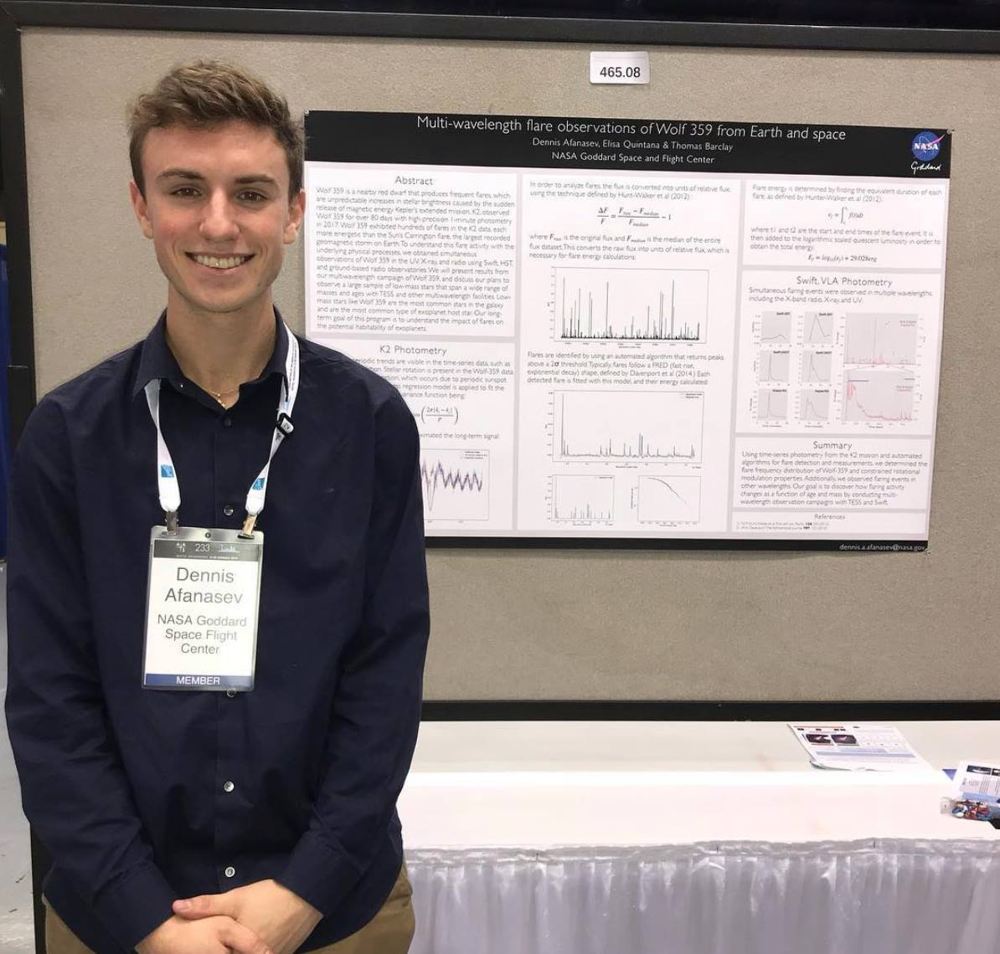

## Team Members

**Dennis Afanasev**  
Computer Science senior at GWU. Interested in operating systems and high performance network function virtualization for middleboxes. 

## CoreCode Demo

### Relevant Links
[Writings](https://drive.google.com/drive/folders/1bSd410L2srpsd_iG8QGGfFWacLTSZKDj?usp=sharing "Writings")  
[Final package](https://drive.google.com/open?id=1gP6d8tKONa8CTSD-U-fXWsP8jPk_ErFL)
